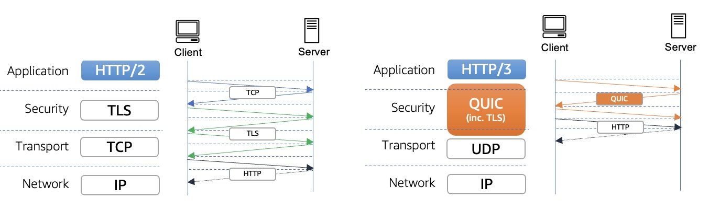
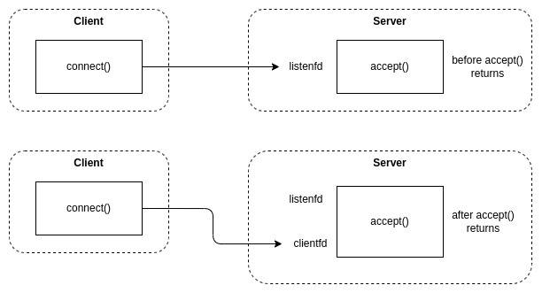
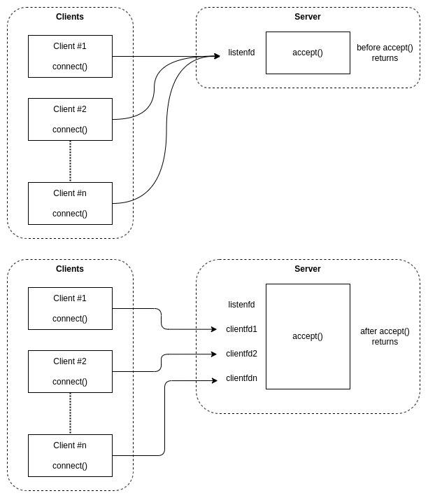

## What happens when you type a URL into your browser?
 
1. You type a URL in your browser and press Enter
2. Browser looks up the IP address for the domain using a DNS lookup.   
Because DNS is complex and has to be blazingly fast, DNS data is cached at different layers between your browser and at various places across the Internet.   
Your browser checks its own cache, the operating system cache, a local network cache at your router, and a DNS server cache on your corporate network or at your internet service provider (ISP).  
If the browser cannot find the IP address at any of those cache layers, the DNS server on your corporate network or at your ISP does a recursive DNS lookup.  
A recursive DNS lookup asks multiple DNS servers around the Internet, which in turn ask more DNS servers for the DNS record until it is found.
3. Browser initiates TCP connection with the server
4. Browser sends the HTTP request to the server
5. Server processes request and sends back a response
6. Browser renders the content

### How DNS Lookup Works
DNS lookup is a process by which an IP address is returned for a domain name by a DNS server. The DNS lookup can also return all the records associated with a domain name such as IP, IPv6 address or MX record, etc.


### List of DNS Records Types
You can select any record to get all common DNS records for a domain from the following types of DNS records.

- **A record**: Also known as **address record**. It points the domain name to an IPv4 address.
- **AAAA record**: It maps the hostname to 128-bits IPv6 address (four times larger than IPv4 in size)
- **CAA record**: Certification Authority Authorization record reflects the public policy regarding the domain's issuance of digital certificates. If no CAA record is present for your domain, any Certification Authority can issue an SSL certificate for your domain. However, by using this record, you can restrict which CA is authorized to issue your domain's digital credentials.
- **CNAME record**: Canonical Name record creates an alias of one domain name. The aliased domain or sub-domain gets all the original Domain DNS records and commonly used to associate sub-domains with the existing main domain.
- **DS record**: Delegation Signer record consists of the unique characters of your public key and its related metadata such as Key Tag, Algorithm, Digest Type, and cryptographic hash value called Digest.
- **DNSKEY record**: It is also known as DNS Key record,containing public signing keys such as Key Signing Key (KSK) and Zone Signing Key (ZSK). The DS and DNSKEY records serve to validate the authenticity of DNS records returned by the DNS Server.
- **MX record**: Mail Exchange records tell which mail exchange servers are responsible for routing the email to the correct destination or mail server.
- **NS record**: Name Server record points to the name servers to manage and publish the domain's DNS records. These are the DNS servers that are authoritative to handle any query related to the domain.
- **PTR record**: The Pointer recordpoints the IPv4 or IPv6 address to its machine's hostname. It provides a reverse DNS record or rDNS record by pointing an IP address to the server's hostname.
- **SRV record**:Service record indicates which specific services the domain operates and port numbers. Some Internet protocols such as the Presence Protocol (XMPP), Extensible Messaging, and the Session Initiation Protocol (SIP) often require SRV records.
- **SOA record**:The Start of Authority recordprovides essential information about the domain, such as identifying the master node of domain authoritative name server, an email of the domain administrator, the serial number of DNS zone, etc.
- **TXT record**: It allows the website's administrator to insert any arbitrary text in the DNS record.
- **SSHFP record**: It is also known as SSH Public Key Fingerprint. It has a resource record for publishing SSH public host key fingerprints in the DNS System to verify the host's authenticity.
- **URI record**: It is also known as Uniform Resource Identifier. It can be used for publishing mappings from hostnames to URIs.

#### CNAME vs ALIAS
CNAME records differ from Alias records in resolving domain names to reach their destination. 

Let’s say you configure a CNAME record pointing www.yourdomain.com to www.anotherdomain.com. 

If someone enters www.yourdomain.com into their browser, the DNS server returns a response for www.anotherdomain.com. Their web browser then executes another DNS lookup for www.anotherdomain.com to get the IP address. 

However, the process is different for Alias records. Instead of returning a response for www.anotherdomain.com, the authoritative DNS server performs the second resolution and returns only the IP address or A record. 

- When you configure a CNAME record for a domain like blog.www.mywebsite.com, you can’t create any other records. Establishing another DNS record alongside a CNAME record can result in conflict, leading to erroneous results. However, this isn’t the case for Alias records, as they can coexist with other types of DNS records, such as NS records, TXT records, and SOA records in the DNS.

- You can’t configure a CNAME record in the zone apex, so it’s impossible to use a CNAME record to point a root domain to another destination. But Alias records don’t have this restriction because, like A records, they return IP addresses.

- But Alias Records Lose Geo-Targeting Data. Alias records may resolve a domain quicker and coexist with other DNS records but they have one drawback: They lose geo-targeting data. When a target domain name (like www.anotherdomain.com) issues queries for another domain (like www.yourdomain.com), the former’s authoritative server is responsible.


### HTTP versions
The first response that a client receives on an HTTP GET request is often not the fully rendered page.  
Instead, it contains links to additional resources needed by the requested page.  
The client discovers that the full rendering of the page requires these additional resources from the server only after it downloads the page.  
Because of this, the client will have to make additional requests to retrieve these resources. 

* In HTTP/1.0, the client had to break and remake the TCP connection with every new request, a costly affair in terms of both time and resources.  
* In HTTP/1.1, the client uses multiple TCP connections to lessen the effect of HOL blocking.   
* In HTTP/2, the client establishes a single connection object between the two machines, called Binary Framing Layer.   
Within this connection there are multiple streams of data. Each stream consists of multiple messages in the familiar request/response format. Finally, each of these messages split into smaller units called frames
* HTTP/3 uses QUIC, a multiplexed transport protocol built on UDP instead of TCP

#### HTTP v2.0

From a technical point of view, one of the most significant features that distinguishes HTTP/1.1 and HTTP/2 is the binary framing layer, which can be thought of as a part of the application layer in the internet protocol stack.   
As opposed to HTTP/1.1, which keeps all requests and responses in plain text format, HTTP/2 uses the binary framing layer to encapsulate all messages in binary format, while still maintaining HTTP semantics, such as verbs, methods, and headers.   
An application level API would still create messages in the conventional HTTP formats, but the underlying layer would then convert these messages into binary. This ensures that web applications created before HTTP/2 can continue functioning as normal when interacting with the new protocol.

#### HTTP v3.0
HTTP/3 uses similar semantics compared to earlier revisions of the protocol, including the same request methods, status codes, and message fields, but encodes them and maintains session state differently.   

However, partially due to the protocol's adoption of QUIC, HTTP/3 has lower latency and loads more quickly in real-world usage when compared with previous versions: in some cases over 3× faster than with HTTP/1.1 (which remains the only HTTP version deployed by many websites).



On 15 Aug, 2022, AWS Cloudfront announced support for Http/3 

### [A much better explaination](https://www.linkedin.com/pulse/http3-over-quic-its-revolutionary-saurabh-pandey/)

### Cross-Origin Resource Sharing (CORS)
Cross-Origin Resource Sharing (CORS) is an HTTP-header based mechanism that allows a server to indicate any origins (domain, scheme, or port) other than its own from which a browser should permit loading resources.   
CORS also relies on a mechanism by which browsers make a "preflight" request to the server hosting the cross-origin resource, in order to check that the server will permit the actual request. In that preflight, the browser sends headers that indicate the HTTP method and headers that will be used in the actual request.

An example of a cross-origin request: the front-end JavaScript code served from https://domain-a.com uses XMLHttpRequest to make a request for https://domain-b.com/data.json.

For security reasons, browsers restrict cross-origin HTTP requests initiated from scripts. For example, XMLHttpRequest and the Fetch API follow the same-origin policy. This means that a web application using those APIs can only request resources from the same origin the application was loaded from unless the response from other origins includes the right CORS headers.

#### What requests use CORS?
This cross-origin sharing standard can enable cross-origin HTTP requests for:

1. Invocations of the XMLHttpRequest or Fetch APIs, as discussed above.
2. Web Fonts (for cross-domain font usage in @font-face within CSS), so that servers can deploy TrueType fonts that can only be loaded cross-origin and used by web sites that are permitted to do so.
3. WebGL textures.
4. Images/video frames drawn to a canvas using drawImage().
5. CSS Shapes from images.

#### Preflighted requests
Unlike simple requests, for "preflighted" requests the browser first sends an HTTP request using the OPTIONS method to the resource on the other origin, in order to determine if the actual request is safe to send. Such cross-origin requests are preflighted since they may have implications for user data.

The following is an example of a request that will be preflighted:
```text
const xhr = new XMLHttpRequest();
xhr.open('POST', 'https://bar.other/resources/post-here/');
xhr.setRequestHeader('X-PINGOTHER', 'pingpong');
xhr.setRequestHeader('Content-Type', 'application/xml');
xhr.onreadystatechange = handler;
xhr.send('<person><name>Arun</name></person>');
```


### CORS Headers

When the browser makes a CORS request, it will send an **'Origin'** header, that states its protocol(scheme) and port number
eg. Origin: https://domain-a.com

#### Access-Control-Request-Method
The Access-Control-Request-Method header notifies the server as part of a preflight request that when the actual request is sent, it will do so with a POST request method.  
eg. Access-Control-Request-Method: POST

#### Access-Control-Request-Headers
The Access-Control-Request-Headers header notifies the server that when the actual request is sent, it will do so with X-PINGOTHER and Content-Type custom headers.

Now the server has an opportunity to determine whether it can accept a request under these conditions.

#### Access-Control-Allow-Origin
The server responds with Access-Control-Allow-Origin: https://foo.example, restricting access to the requesting origin domain only. 

#### Access-Control-Allow-Methods
It also responds with Access-Control-Allow-Methods, which says that POST and GET are valid methods to query the resource in question (this header is similar to the Allow response header, but used strictly within the context of access control).

#### Access-Control-Allow-Headers
The server also sends Access-Control-Allow-Headers with a value of "X-PINGOTHER, Content-Type", confirming that these are permitted headers to be used with the actual request.   
Like Access-Control-Allow-Methods, Access-Control-Allow-Headers is a comma-separated list of acceptable headers.

### Access-Control-Max-Age
Access-Control-Max-Age gives the value in seconds for how long the response to the preflight request can be cached without sending another preflight request. The default value is 5 seconds.


# How does HTTPS work?

Hypertext Transfer Protocol Secure (HTTPS) is an extension of the Hypertext Transfer Protocol (HTTP.)   
HTTPS transmits encrypted data using Transport Layer Security (TLS.) If the data is hijacked online, all the hijacker gets is binary code. 

#### How is the data encrypted and decrypted?


1. The client (browser) and the server establish a TCP connection.
2. The client sends a “client hello” to the server. The message contains a set of necessary encryption algorithms (cipher suites) and the latest TLS version it can support. The server responds with a “server hello” so the browser knows whether it can support the algorithms and TLS version.
3. The server then sends the SSL certificate to the client. The certificate contains the public key, host name, expiry dates, etc. The client validates the certificate. 
4. After validating the SSL certificate, the client generates a session key and encrypts it using the public key. The server receives the encrypted session key and decrypts it with the private key. 
5. Now that both the client and the server hold the same session key (symmetric encryption), the encrypted data is transmitted in a secure bi-directional channel.

#### Why does HTTPS switch to symmetric encryption during data transmission? There are two main reasons:
1. Security: The asymmetric encryption goes only one way. This means that if the server tries to send the encrypted data back to the client, anyone can decrypt the data using the public key.
2. Server resources: The asymmetric encryption adds quite a lot of mathematical overhead. It is not suitable for data transmissions in long sessions.


| What is a DDoS attack? |
|---|
|The purpose of a DDoS attack is to disrupt the normal traffic of the victim servers through malicious requests. As a result, the servers are swamped with malicious requests and have no buffer to handle normal requests.|
| **An example of a common DDoS attack is an SYN flood.**|
| Normally the client and server establish a TCP connection via a 3-way handshake. As a result of an SYN flood attack, zombies (network of computers controller by attacker) send many SYN requests to the server, but they never return the TCP ACK to the server. |
| This results in an exhaustion of resources on the victim server due to the accumulation of many half-open TCP connections.|


### Client Certificate vs Server Certificate

Server certificates perform encryption on data-in-transit to assure data confidentiality. eg. SSL certificates
Client certificate does not encrypt any data, it only serves as a more secure authentication mechanism than passwords. eg. Email certificates


## How does one web server handle so many requests on the same port?
The classic ‘forking’ design would have a single master process which BINDs to a port (80) and listens. When it gets a connection it calls the ‘fork()’ system call and the resulting child process reads the request and returns a response, then terminates. This is the oldest paradigm of network services in the *nix/BSD Socket API model. It works, but the child processes can be slow to get going. Fork is a low overhead call, but it still adds up when server loads start to build up.

**Apache** introduced the ‘pre-forking’ pattern in the early 90’s. In this paradigm the child processes are forked at server startup after the BIND to port 80, so they each inherit a copy of the open socket, and they all listen on it. The advantage is that no work is done in the master, and the children are already up and running, so there’s less overhead. This pattern prevailed for a long time.

Next up was the multi-threaded model. This is basically not much different from the pre-forking model, except it uses threads instead of fork. So there is only one server process. The disadvantage is of course any leaks in that process (maybe caused by buggy plugins or whatever) will eventually kill the process.

So Apache pretty much always used the hybrid model, which meant it pre-forked a bunch of child servers and then each of them used threading to serve up multiple requests in parallel. This model prevailed for a LONG time, and is still the model generally in use with Apache.

Finally, the entire idea of using multiple streams of execution, processes or threads, was found to be creating the ultimate bottleneck. The constant context switches and problems with scheduling different processes and threads creates a lot of overhead, so the reactor model was developed.  

The reactor model uses a SINGLE THREAD to handle all work!   
It listens, handles the request, and then listens for the next request. The trick is everything is non-blocking.  
That is, say the request needs to read a file from disk, instead of making a blocking OS call to read(), which is the classic way to do things, instead a non-blocking call is made, which registers a callback. When the read finishes, a message is posted to a queue, telling the process to run the callback. Instead of blocking on LISTEN to the TCP port, the same non-blocking strategy is used. The main thread then simply waits on the queue, handling each task which comes in (which may initiate further tasks). No context switches happen at all, and virtually 100% of theoretical performance is achieved, all work is useful work.

**Nginx** famously brought the reactor pattern to web servers, and it has reigned as the king of HTTPDs for a good while now due to its virtually unmatched efficiency. The only downside, technically, is that this one server process better not memory leak or crash, though even this can be handled by giving it a shepherd process which monitors it and makes sure it gets restarted if anything goes wrong, or after a certain number of requests are processed, etc.


### So how does it work
The web server opens a single TCP port and listens on it. This port (0 to 65535, (with some reserved)) is a **Logical Port**.   
Logical Port, unlike Physical ports such as USB ports, Serial Ports, Ethernet ports, support many-to-many connections

* When we run a web server, it creates a socket (with listenfd socket file descriptor) to listen on a port and then waits for incoming connections.
* when the server receives a connection request from a client, it creates another socket (clientfd) to handle the request.



* In case there are concurrent requests, and the server is capable of handling them, then the server will simply create a new socket (clientfd*) for each request:




A socket file descriptor is an integer value and unique per socket. The operating system associates socket file descriptors with various values in the background, such as a combination of client IP and port, server IP and port, and communication protocol.   
Now whenever the server wants to communicate with the client, it only needs to pass the socket file descriptor to the socket API, and then the OS will know which channel to use.   

Hence, The server sees multiple requests as multiple open file descriptors and does I/O on each one separately.
